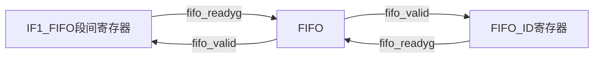
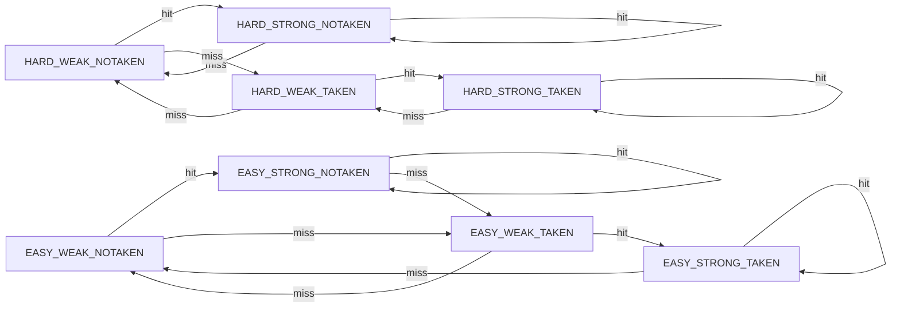
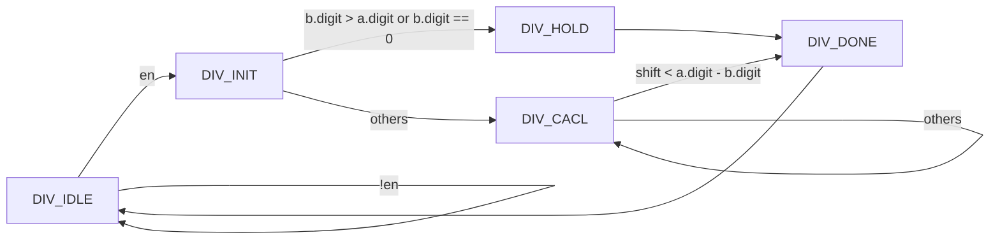
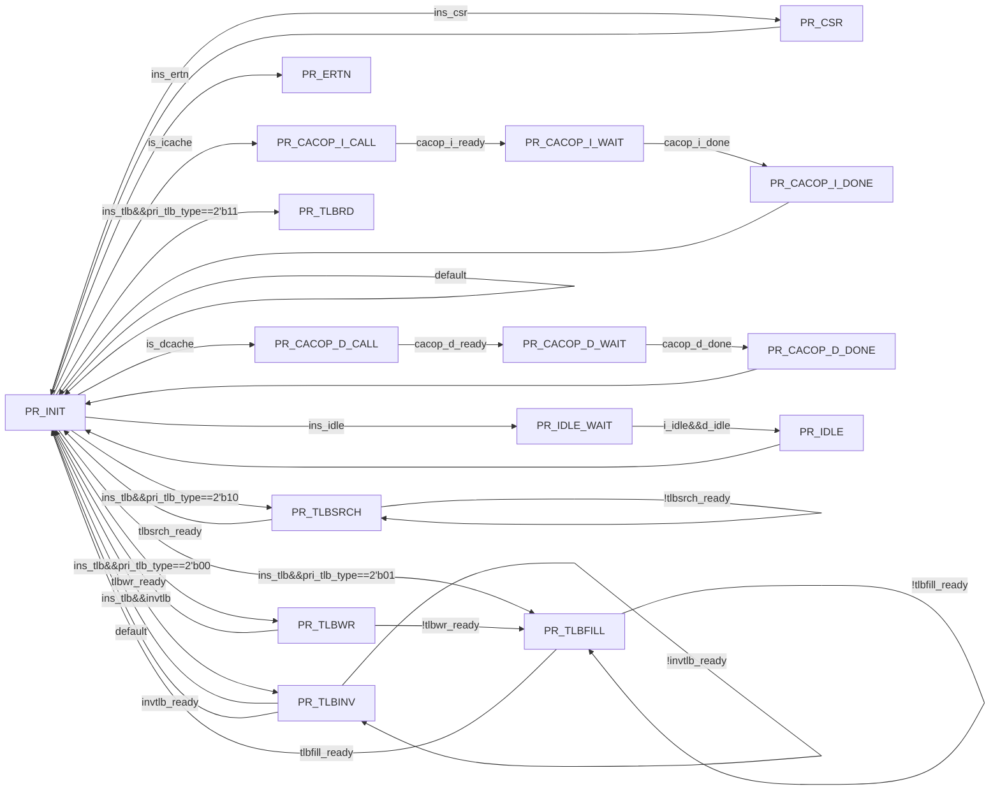

# 龙芯杯AmberCPU设计报告

<center>中国科学技术大学Amber队</center>

<center>常文正、刘睿博、于硕、闫泽轩</center>

## 设计简介

我们设计的 CPU 采用顺序双发射九级流水，实现了 67 条指令、26 种 CSR 寄存器、16 种例外[^0]。

采用 AXI-4 总线。使用 2 路组相联 8KB icache 和 2 路组相联 8KB dcache，采用写回、按写分配的设计，同时两个cache中都采取了 8 路全相连 1KB victim cache用于优化缓存失效带来的性能损失。并使用分支预测器以减少分支失败带来的性能损失。

### 设计变更说明（可选）

本小节仅用于决赛阶段提交设计相对于预赛阶段提交设计有变更的情况。

请说明设计变更意图，并逐条简要列出设计变更内容，最终说明变更所达到的效果。

## 二、设计方案


### （一）总体设计思路

>阐明总体设计思路，即从系统顶层角度出发，概要性地描述整个系统的工作机制，所需要进行哪些设计、完成哪些功能。如果设计比较复杂，那么最好进行模块划分，把每个模块功能和接口的大致情况描述一下。

我们具体设计的cpu基于LoongArch32位精简版参考手册[^0]，参考了姚永斌老师的《超标量处理器设计》[^1]、汪文祥老师的《计算机体系结构基础》[^4]、汪文祥老师和刑金璋老师的《CPU设计实战》[^3]等书籍,并参考了开源项目clap[^2]的译码器实现。

#### 段间寄存器valid-ready握手协议


readygo_23和allowin_21由流水段传入段间寄存器的组合信号，由段间寄存器产生
readygo_23和allowin_21还与段间寄存器自身情况有关，这里假设自身准备好，如果自身没准备好，对外readygo_23和allowin_21均为0
readygo_23不能受allowin_23控制
伪代码表示：
```
readygo_23 =valid (valid表示自身情况,无阻塞的流水段逻辑恒为1,有阻塞的先0,有效时数据和valid同时为1) 
allowin_21 = allowin_23 || ready (ready表示自身情况)
if(readygo_12 && allowin_23&&allowin_21)
	更新段间寄存器2
if(~readygo_12 && allowin_23&&readygo_23)
	清空段间寄存器2（所有控制信号置为0，防止上一周期的指令被重复执行）
if(~allowin_23||~allowin21)
	维持段间寄存器2（所有寄存器值不动，防止上一周期的指令被丢失）
```

> 注：这种握手对于一般一级段间寄存器已经足够，但是对于FIFO或者CACHE这种不定周期并且不能简单由组合信号阻塞的流水段还需要另外的精心设计来产生握手控制信号。这样的基本目标是满足指令PC不重不漏。

### （二）FIFO模块设计
我们在取指段（IF）和译码段（ID）之间使用了FIFO作为PC和指令等信息的缓冲。

添加FIFO的作用是为了解决流水线前后段速率不匹配的问题，换句话说就是减少前后段Stall互相之间的掣肘，比如在流水线前段可能会出现IcacheMiss，在流水线后段可能会出现DIV/DcacheMiss。在这个时候
FIFO队列在不满时对于前段可以屏蔽后段产生的Stall继续取指，同理对于后段可以一定程度上减少前段IcacheMiss产生的暂停并且继续连续发射指令。

但是，尽管FIFO的设计看起来十分美好，FIFO在满时会产生严重的问题：丢指令。

为了避免丢指令，我们设计了状态机，利用FIFO队列引出的full/nearly/we等信号在即将丢指令的同时巧妙地获取到了即将被丢失的指令的情况下，先阻塞前端流水段，之后在队列有空时插进队列，然后才继续进行流水。

由于我们的Icache不能直接被Stall，并且TLB要经过寄存器传递信息，因此仅仅将FIFO满时的指令插入后可能前面阻塞的流水段仍然在取相同的指令，导致指令可能反而被填充两次FIFO。

经过仔细观察，在IF0_allowin为1时的fetch_pc是每次有效且与时钟周期一一对应（不 会因为allowin阻塞而在寄存器中暂存超过一个周期）的，因此在考察流水线长度后我选择了合适的一个相对小的FIFO作为辅助保证正确性的设计。



同其它流水段的allowin/readygo相比，FIFO本身本质上是一个新的流水段，因此使用了4个握手信号，分别提供给首尾的段间寄存器进行握手。

###  (三) 分支预测器设计
分支预测器使用了多种设计进行综合判断。

分支预测器作用是预测跳转指令的目标地址，但是困难在于PC更新时简单的分支预测器仅仅能够fetch_pc的信息预测下一条取指地址。同时如果使用查表的方法，为了权衡节约空间和区分不同PC的目的，我们在IF0段需要使用合适的寄存器数组长度来进行跳转与否，跳转地址的预测。


#### taken判断思路

1. 静态预测器：默认不调转，仅仅作为复位后的初始状态时采用。
2. 全局预测器:使用EASY_STATE和HARD_STATE两种状态进行竞争，两种STATE本质上都是2bit预测器，一种是预测失败就切换成相反的预测，另一种是给予一次额外的机会。两种STATE通过SCORE状态机来判断采纳哪一种。
3. 局部历史预测器：使用一个寄存器数组对于每一个PC对应的INDEX进行预测。
4. 指令类型前递辅助预测：使用取指后的预译码器（pre_decoder）来判断筛选一些无条件跳转，非跳转的指令，将译码的信息使用UMASK，BMASK保存，优先使用两个寄存器数组的掩码信息来判断跳转与否。
   

#### PC判断思路
使用DRAM的寄存器堆来存储预测PC。由于指令无论跳转与否，使用PC_relative方法寻址的跳转指令的跳转目标地址是固定的，而对于寄存器寻址的跳转指令又过于灵活，我们认为采用每一种INDEX仅对应一个目标地址的设计已经是比较平衡的设计。

#### INDEX拼接技巧
对于一个PC的INDEX来说，最自然简单的设计就是取低INDEX_WIDTH位,或者去掉低两位（PC对齐）或者低三位（指令连续双发）。

但是对于程序中跳转指令的空间分布特性可以认为跳转指令不会连续或者高密度出现，并且不同进程占据的空间在较高位会有显著区别，而这时的跳转指令目标地址又几乎不可能在低位部分重合。

因此我们选择的INDEX是{PC[19],PC[14:10],PC[5:4]}.目的是使用更少的PC信息来获得更高的指令命中率。

### (四) EX阶段设计

#### EX段概述
EX阶段总计三级流水线，ALU指令在EX0段完成，乘法指令在EX0段与EX1段分两个周期完成，除法指令和特权指令在EX0段进入各自的状态机进行，并阻塞流水线，最后向流水线发送ready，然后流水线继续流动。

跳转指令在EX0段判断是否需要跳转并计算跳转目标地址，同时向分支预测器发送信息来协助分支预测，如果分支预测失败，则清空EX0段之前的流水线的指令，IF0段重新取指。

访存指令在EX0段向TLB发送虚地址，EX1段TLB向cache发送实地址，如果dcache命中，则在EX2段完成访存，否则阻塞流水线

#### 数据前递模块
为处理数据相关问题，EX1,EX2,WB段的数据如果完成则需要进行前递来减少流水线的停顿。

EX1后面的段间寄存器保存段间数据valid信号来确保数据可以正确前递，没有准备好的数据需要前递时，阻塞流水线，待valid置为1时再进行前递。同时为了保证写的数据可以立即被后续指令读取，寄存器堆采取写优先设计，保证数据有效

#### 除法器设计

> a(被除数) / b(除数) = x(商) ··· y(余数)



### (五) 特权指令实现



### （三）XX模块设计（可选）

三
>对模块内部设计方案进行更进一步描述。可以包含：模块的功能意图，模块的输入输出，模块内部的数据通路和控制逻辑，以及可能的软硬件交互机制。

……

 

## 三、设计结果

请不要大篇幅地直接粘贴代码。

### （一）设计交付物说明

说明所提交设计的目录层次，各目录下对应的内容是什么。提供所提交设计进行仿真、综合、上板演示的必要操作提示步骤。

### （二）设计演示结果

以文字、图、表等形式展示设计的演示结果。

## 四、参考设计说明

我们的AmberCPU中绝大多数设计都是完全自主完成的，但是也有一些设计参考了其他开源项目，这里列出了我们参考的开源项目：
| 项目名称 | 项目地址 | 说明 |
| -------- | -------- | ---- |
| [clap][^2] |https://github.com/npz7yyk/clap| 参考译码器的实现 |


## 五、参考文献

[^0]: 龙芯中科技术股份有限公司 芯片研发部. *龙芯架构 32 位精简版参考手册*[S/OL]. 北京: 龙芯中科技术股份有限公司. 2023, v1.03. https://www.loongson.cn/FileShow

[^1]: 姚永斌. *超标量处理器设计*[M]. 北京: 清华大学出版社. 2014.
[^3]: 汪文祥 and 刑金璋. *CPU 设计实战*[M]. 北京: 机械工业出版社. 2021.
[^4]: 胡伟武. *计算机体系结构基础*[M]. 北京: 机械工业出版社. 2021, ed. 3.
[^2]: npz7yyk. *clap* [CP/OL]. GitHub. 2022 (20220814). https://github.com/npz7yyk/clap 