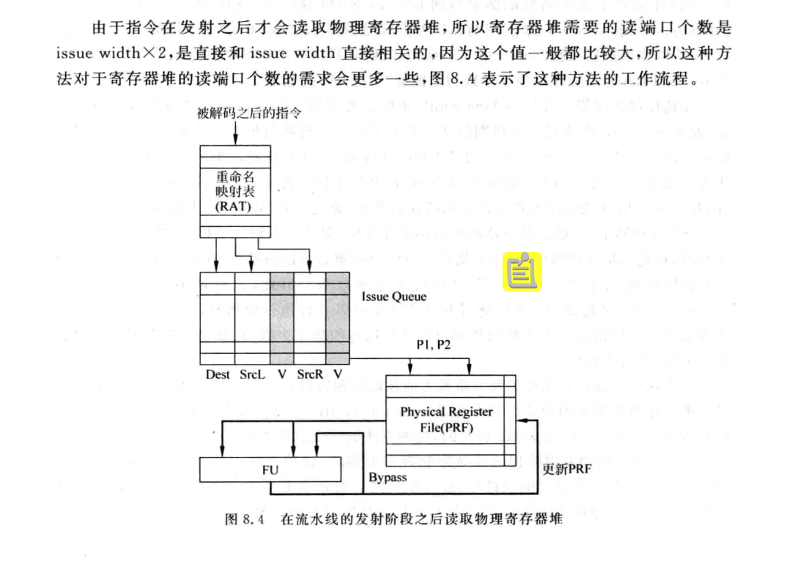
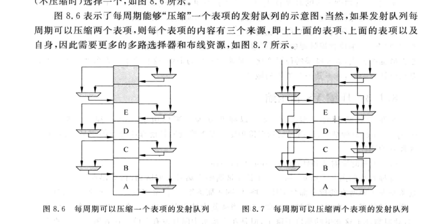
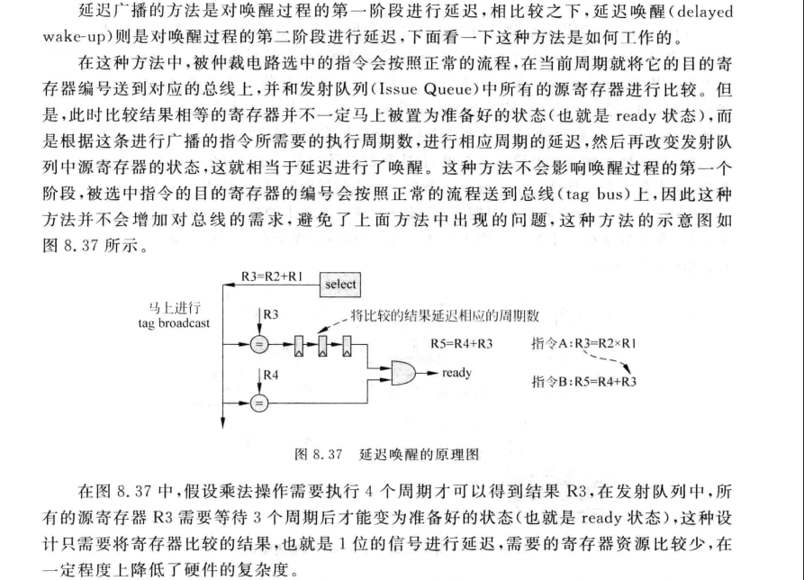

# FPGA笔记
## DRAM,BRAM
在做读操作的时候，BRAM和DRAM不同。DRAM是组合逻辑直接输出，BRAM则是时序逻辑输出。

## SRAM
用于高速缓存，4片，共8MB。两片一组，分别叫BaseRAM ExtRAM 1024K*16bit=2MB,20位地址线，位拓展成32位内存
# 龙芯杯笔记
## 第五次线上培训
1. CPU

# 分支预测器（BTB）
组成部分
1. Branch Address
2. Target Address
3. Branch Type
4. Prediction
5. Valid Bit
6. BIM(Branch History Info):分支历史信息，记录历史行为用于分支预测
7. RAS(Return Address Stack)返回地址栈，用于函数调用的处理。处理器遇到函数地址后，将返回地址推入RSA中，当函数执行完毕是，处理器会从RSAzhong弹出返回地址。

# Issue

结构功能