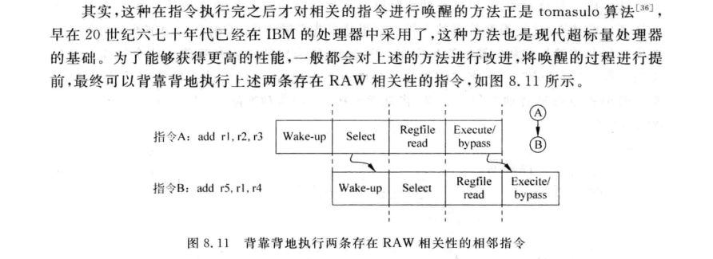

# FPGA笔记
## DRAM,BRAM
在做读操作的时候，BRAM和DRAM不同。DRAM是组合逻辑直接输出，BRAM则是时序逻辑输出。

## SRAM
用于高速缓存，4片，共8MB。两片一组，分别叫BaseRAM ExtRAM 1024K*16bit=2MB,20位地址线，位拓展成32位内存

# 龙芯杯笔记
## 第五次线上培训
1. CPU

# 分支预测器（BTB）
组成部分
1. Branch Address
2. Target Address
3. Branch Type
4. Prediction
5. Valid Bit
6. BIM(Branch History Info):分支历史信息，记录历史行为用于分支预测
7. RAS(Return Address Stack)返回地址栈，用于函数调用的处理。处理器遇到函数地址后，将返回地址推入RSA中，当函数执行完毕是，处理器会从RSAzhong弹出返回地址。

# Issue

结构功能

# 分派器
在顺序双发射（Sequential Dual-Issue）CPU中，分派器（Dispatcher）是一项关键的功能单元，用于将指令从指令队列中选择并发送给可用的执行单元进行并行执行。

分派器的主要功能是解码和分配指令，将其发送到适当的执行单元。它基于指令的操作类型、操作数依赖性和可用的执行资源来进行指令调度和分发。

以下是分派器的主要任务和特性：

1. 指令解码：分派器解码从指令队列中取出的指令，将其转换为内部CPU能够理解和执行的形式。这包括识别指令的操作码和操作数，以及确定指令的类型（如算术逻辑指令、存储指令、分支指令等）。

2. 操作数依赖性检测：分派器检查指令的操作数是否依赖于之前尚未完成的指令的结果。如果存在依赖关系，分派器可能需要等待依赖指令的结果就绪后再分派当前指令。

3. 执行单元分配：分派器根据可用的执行单元（如整数单元、浮点单元、加载/存储单元等）和指令的要求，将指令分配给适当的执行单元。这样可以实现并行执行多条指令，充分利用处理器的资源。

4. 分派器缓冲区：分派器通常具有一个缓冲区，用于存储已解码的指令，并在分派到执行单元之前等待。这个缓冲区可以用于处理指令的优先级、指令重排序和流水线调度等问题。

通过有效的指令调度和分派，分派器在顺序双发射CPU中发挥着重要的作用。它允许多条指令在同一时钟周期内并行执行，提高了处理器的指令级并行度和整体性能。